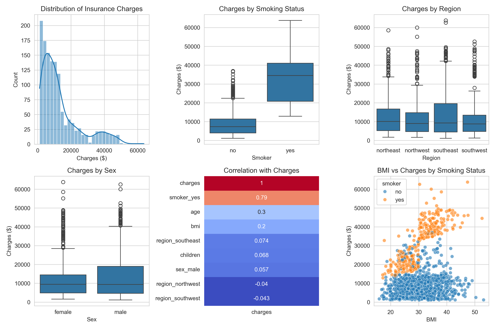

 # U.S. Medical Insurance Cost Analysis

##  Overview

This project analyses a dataset of 1,338 U.S. medical insurance records to understand what factors most influence insurance premiums. A linear regression model is built to predict medical charges based on patient demographics and lifestyle factors.

**Author:** Eleanor Bryan  
**Date:** 2026  
**Project Type:** Personal Portfolio Project

---

 Dataset

The dataset comes from the **"Machine Learning with R"** textbook and is publicly available via Kaggle.

| Feature | Description |
| :--- | :--- |
| `age` | Age of primary beneficiary (18–64) |
| `sex` | Gender (female/male) |
| `bmi` | Body Mass Index |
| `children` | Number of dependents covered |
| `smoker` | Smoking status (yes/no) |
| `region` | Residential area in the US |
| `charges` | Medical costs billed by health insurance ($) |

- **Rows:** 1,338  
- **Columns:** 7  
- **Missing Values:** None

---

##  Tools & Libraries

| Tool | Purpose |
| :--- | :--- |
| **Python** | Core programming language |
| **Pandas** | Data manipulation and cleaning |
| **NumPy** | Numerical operations |
| **Matplotlib & Seaborn** | Data visualisation |
| **Scikit-learn** | Predictive modelling (Linear Regression) |

---

## Key Findings

| Finding | Insight |
| :--- | :--- |
| **Smoking is the strongest predictor** | Smokers pay **$23,615 more** on average than non-smokers |
| **BMI and age also matter** | Higher BMI and older age are associated with higher premiums |
| **Region and sex have minimal impact** | Regional differences are small; sex has almost no effect |

### Model Performance

| Metric | Result |
| :--- | :--- |
| **R-squared** | 0.79 |
| **Mean Absolute Error** | $4,182 |

---

##  Visualisations



*The visualisation above shows: distribution of charges, charges by smoking status, charges by region, charges by sex, correlation heatmap, and BMI vs charges by smoking status.*

---

##  Summary Statistics

| | age | bmi | children | charges |
| :--- | :--- | :--- | :--- | :--- |
| **count** | 1338.00 | 1338.00 | 1338.00 | 1338.00 |
| **mean** | 39.21 | 30.66 | 1.09 | $13,270.42 |
| **std** | 14.05 | 6.10 | 1.21 | $12,110.01 |
| **min** | 18.00 | 15.96 | 0.00 | $1,121.87 |
| **25%** | 27.00 | 26.30 | 0.00 | $4,740.29 |
| **50%** | 39.00 | 30.40 | 1.00 | $9,382.03 |
| **75%** | 51.00 | 34.69 | 2.00 | $16,639.91 |
| **max** | 64.00 | 53.13 | 5.00 | $63,770.43 |

---

##  Conclusions

This analysis demonstrates that **lifestyle factors (particularly smoking)** have a far greater impact on insurance costs than demographic characteristics alone. The findings suggest:

1. **Public health interventions** targeting smoking could significantly reduce healthcare costs
2. **Insurance pricing** appropriately uses smoking status as a key risk factor
3. **Further research** could explore the causal relationship between smoking and other health outcomes

---

##  Connect With Me

- **LinkedIn:** [linkedin.com/in/eleanor-bryan-35b922255](https://www.linkedin.com/in/eleanor-bryan-35b922255/)
- **GitHub:** [github.com/eleanor-analytics](https://github.com/eleanor-analytics)


---

## 📂 How to Run This Project

1. Clone the repository:
   ```bash
   git clone https://github.com/eleanor-analytics/medical-insurance-analysis.git
